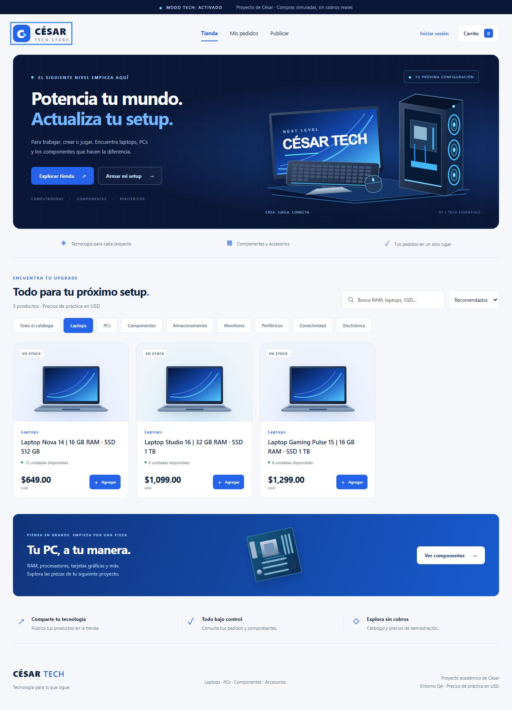
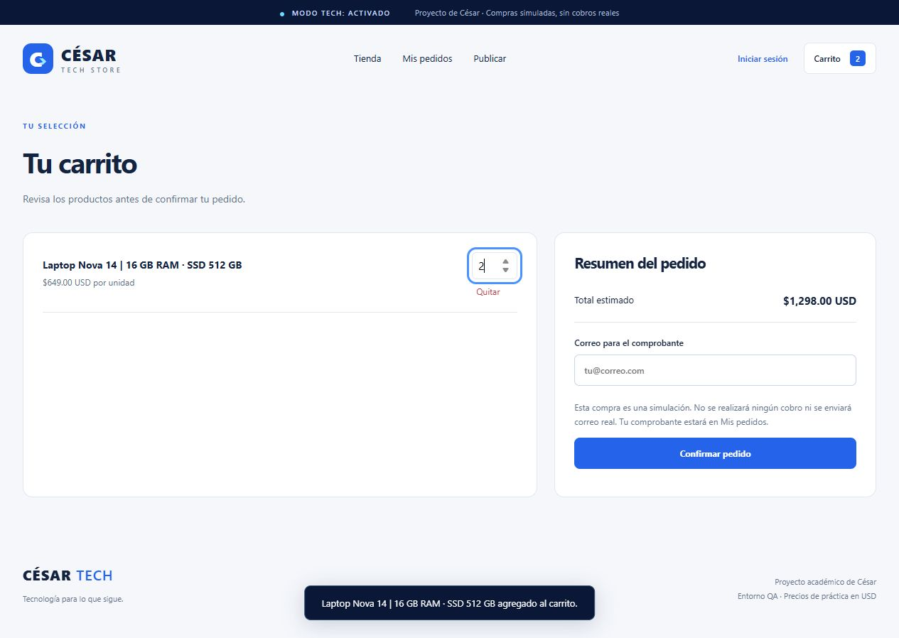

# César Tech — rediseño de la tienda de QA

Fecha: 29 de septiembre de 2026. Proyecto independiente de César. Sitio: [César Tech](http://3.80.212.96:5000/).

## Resultado

Se publicó una tienda de tecnología con azul eléctrico, azul marino, portada ilustrada, tarjetas de productos y diseño adaptable a computadora y celular. Se agregaron **28 productos de demostración** a los cuatro que existían al iniciar. La revisión final observó 33 productos porque durante el trabajo se publicó también un producto llamado “RAM”; se conservó esa actividad.

## Cambios realizados

- Identidad visual “César Tech”, navegación, portada, catálogo, carrito, formularios y pie de página en la misma paleta.
- 18 ilustraciones SVG locales: portada y tipos de producto. Son ilustraciones genéricas, no fotografías de modelos comerciales.
- Ocho categorías: laptops, PCs, componentes, almacenamiento, monitores, periféricos, conectividad y electrónica.
- Filtros combinados con búsqueda; búsqueda sin distinción de acentos; precios ordenables de menor a mayor y viceversa.
- Etiquetas de existencias y botón deshabilitado para productos agotados.
- Actualización inmediata del total al escribir una cantidad válida en el carrito.
- Controles de teclado, foco visible, enlace para saltar al contenido y respeto de la preferencia de movimiento reducido.
- Catálogo ampliado mediante inserciones; no se reemplazaron filas existentes.

Los nuevos productos incluyen tres laptops, tres PCs, dos kits de RAM, dos SSD, disco externo, memoria USB, procesador, GPU, tarjeta madre, fuente de poder, gabinete, ventiladores, dos monitores, audífonos, webcam, teclado, mouse, router, hub, kit de electrónica y placa microcontroladora.

Las especificaciones, existencias iniciales y precios son datos ficticios de práctica en USD. No representan ofertas comerciales ni garantizan compatibilidad entre componentes. Las compras continúan siendo simuladas.

## Alcance técnico

Se cambiaron `app/templates/index.html`, `app/static/app.js`, `app/static/style.css` y las ilustraciones de `app/static/`. Se añadió `scripts/catalogo_tech.py` para cargar el catálogo sin duplicar nombres ya presentes.

La categoría se deduce del nombre en la interfaz. Los productos nuevos publicados con nombres desconocidos se muestran como periféricos; conviene incluir el tipo de producto en su nombre. No se añadieron columnas o tablas a RDS. Los IDs, precios y existencias continúan llegando desde la API; el servidor conserva el cálculo y validación de las compras.

El archivo `app/main.py` conserva el SHA-256 `5d9087283aad2df4f1f250fffc82d948f50d6ef93f05214ff776bee8a01aec01`. No se modificaron autenticación, comprobantes, reglas de AWS, permisos, infraestructura, dependencias ni el servicio de notificaciones en este rediseño.

## Validación

| Comprobación | Resultado |
|---|---|
| Pruebas aisladas existentes | 29 de 29 aprobadas contra el código final |
| Pipeline | Secretos, SAST, pruebas, IaC y SBOM aprobados |
| Salud de la aplicación | RDS, S3 y notificaciones conectados; dos contenedores saludables |
| Página y archivos | Inicio HTTP 200; los 20 recursos estáticos respondieron 200 y coincidieron con sus archivos |
| Categorías | 3 laptops, 4 PCs, 9 componentes, 4 de almacenamiento, 3 monitores, 6 periféricos, 2 de conectividad y 2 de electrónica |
| Búsqueda | “grafica” encuentra “Tarjeta gráfica”; una búsqueda inexistente muestra el estado vacío |
| Orden de precios | Ascendente y descendente comprobados |
| Carrito | RAM + SSD suman USD 198; dos laptops Nova suman USD 1,298 al cambiar la cantidad; quitar productos vacía el carrito |
| Acceso | Confirmar como invitado abre el diálogo de sesión |
| Pantalla móvil | Vista de 390 × 844, ancho útil 375 px; sin desbordamiento horizontal |
| Consola del navegador | Sin errores observados al finalizar |

En la revisión se corrigieron dos ambigüedades de clasificación: “disco externo portátil” corresponde a almacenamiento y “placa microcontrolador con WiFi” corresponde a electrónica. Las ocho categorías se comprobaron después del ajuste.

No se generaron compras ni usuarios nuevos para validar este rediseño. Los elementos añadidos al carrito de la sesión de prueba se retiraron al terminar. Las compras autenticadas y comprobantes ya tenían pruebas de integración documentadas en [la revisión de QA anterior](QA_2026-09-29.md); esta intervención repitió las pruebas aisladas y la revisión de interfaz.

La captura móvil completa está en [04_tech_movil.png](capturas_qa/04_tech_movil.png). Los reportes automáticos finales están en `reportes/tech_20260929_final/`. Ejecución final del pipeline: 2026-09-29 09:20:59 UTC; comprobación de salud y archivos: 09:23:39 UTC.

## Datos conservados y respaldo

Cuenta AWS `940828937790`, instancia `i-0d077a1e93b366368`, proyecto remoto `/home/ec2-user/avance2_marketplace`.

Los nuevos productos creados por este cambio tienen IDs **7 a 34**. El cargador usa una transacción, parámetros SQL y un bloqueo para evitar dos cargas simultáneas de este mismo proceso. Ejecutado después en modo consulta, encontró cero productos pendientes; no repuso stock ni alteró precios de productos existentes.

Los productos previos 1, 2, 3 y 6 se conservaron. Entre la inspección y el despliegue se observó que el producto 6 pasó de 10 a 0 existencias por actividad ajena a esta intervención; el cargador no ejecuta actualizaciones de stock. También apareció el producto “RAM”. Se mantuvieron los dos usuarios y los tres pedidos observados al cierre.

Respaldo anterior al rediseño:
- `/home/ec2-user/qa_respaldo_tech_20260929/interfaz_anterior.tar.gz`
- `catalogo_anterior.json` y `catalogo_insertado.json` dentro de esa misma carpeta.
- Imagen `cesar-qa-api:antes-tech-20260929`.

Imagen final de la API: `sha256:e1a60bb19d75c542fd3632099c87d66b37439294b7c38457869c9d398bb95130`.

Para revertir **solo la interfaz**, se puede restaurar el archivo de respaldo en la carpeta del proyecto, volver a etiquetar la imagen anterior como `avance2_marketplace-api` y recrear únicamente la API con `docker compose up -d --no-build --no-deps api`. No se deben restaurar existencias históricas ni borrar productos que pudieran estar asociados con actividad posterior. El respaldo visual no contiene credenciales.

El sitio conserva el alcance académico de QA por HTTP y sin pagos reales. La verificación no acredita un despliegue a producción. El disco de la instancia seguía con 1.3 GiB disponibles (85% utilizado); el rediseño no requirió nuevos servicios o tamaños de recursos.

