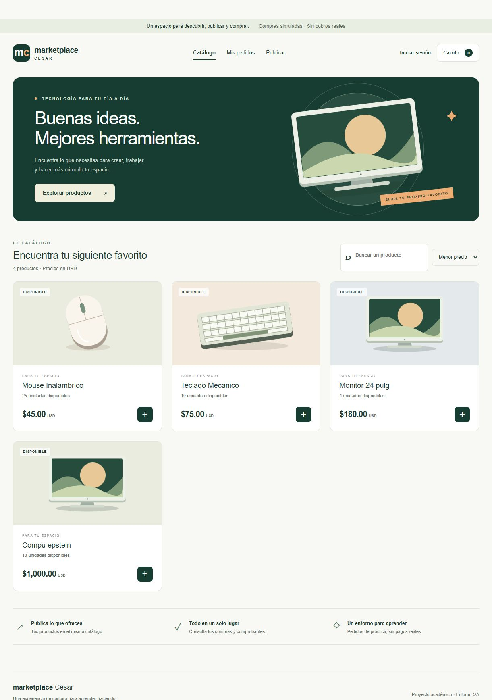
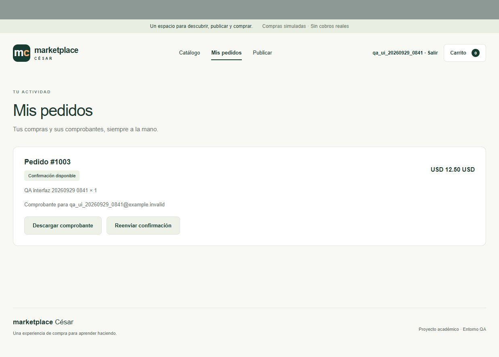

# Revisión, corrección y validación de QA — César

> Actualización posterior: la interfaz fue rediseñada como César Tech y se amplió el catálogo. Consulta [el informe del rediseño](DISENO_TECH_2026-09-29.md) para el aspecto y las comprobaciones más recientes. Las capturas de este informe corresponden a la fase inicial de reparación.

Fecha: 29 de septiembre de 2026. Responsable del proyecto: César Eduardo Valdez Pinto. Cuenta de AWS: `940828937790`. Instancia intervenida: `InstanciaQA`, `i-0d077a1e93b366368`.

## Resultado

La página de QA funciona en [http://3.80.212.96:5000/](http://3.80.212.96:5000/). Se verificaron catálogo, registro, acceso, publicación, carrito, compra simulada, persistencia, comprobantes en S3 y controles de propiedad de pedidos. Los dos contenedores quedaron activos y saludables.

La revisión incluyó 29 pruebas aisladas y 11 grupos de comprobaciones de integración contra el entorno real. Las pruebas aisladas anteriores a la corrección mostraron tres fallos reproducibles. Las compras son simuladas: no hay cargos ni envío de correo externo.

## Qué estaba mal y qué se cambió

| Hallazgo comprobado | Corrección aplicada | Evidencia |
|---|---|---|
| `/` respondía 404; la plantilla estaba vacía | Ruta de inicio e interfaz con catálogo, búsqueda, carrito, cuenta, publicación y pedidos | Captura del navegador y respuesta HTTP 200 |
| Un token construido a partir del ID era aceptado | Firma y vencimiento de sesión; los tokens manipulados o vencidos se rechazan | Pruebas de token falso, alterado y vencido |
| El checkout aceptaba usuario y precio del cliente sin sesión | Sesión obligatoria; usuario tomado del token y total calculado desde RDS | Compra anónima 401; intento de suplantación/precio reducido no altera propietario ni total |
| La compra no descontaba existencias | Validación de cantidades, bloqueo de filas y pedido/stock dentro de una transacción | Pruebas de stock y rechazo sin pedido parcial |
| Existían IDs manuales adelantados respecto a sus secuencias | Se avanzaron únicamente las secuencias de productos y pedidos, sin bajar valores ni modificar registros existentes | Bitácora del despliegue |
| Fallar S3 podía presentarse como éxito | Confirmación vinculada al pedido y estado pendiente explícito ante fallo | Pruebas con fallos simulados y comprobante real AES256 |
| El segundo servicio estaba levantado pero no participaba en el flujo | La confirmación llama al servicio existente por la red interna | Integración real y `/salud` |
| `/salud` siempre devolvía éxito aunque fallara RDS | Comprueba RDS, S3 y notificaciones; devuelve 503 si hay una dependencia indisponible | Prueba de fallo de RDS y respuesta real de salud |
| No había política de reinicio de contenedores | `restart: unless-stopped` en ambos servicios | Configuración Docker verificada |
| El puerto del notificador se publicaba en el host | Se mantiene solo dentro de Docker; la API conserva el puerto 5000 | Estado y puertos de los contenedores |
| El pipeline podía aprobar sin herramientas y solo buscaba palabras para validar permisos | Bloqueo por herramienta ausente, pruebas reales, código de salida obligatorio y validación de un SBOM nuevo | Ejecución del pipeline y prueba de herramienta ausente |
| Había una contraseña de ejemplo en el inicializador | Se retiró del código; un usuario inicial nuevo exige una variable externa | Revisión de `init_db.py`; no se cambió la contraseña existente de César |

Se conservaron las dependencias directas del proyecto. La interfaz no requiere bibliotecas externas ni servicios nuevos. No se aplicó Terraform, no se cambiaron reglas de red de AWS, roles de instancia, tamaños, bases de datos, cifrado de discos o contraseñas existentes.

## Pruebas realizadas

**Antes del cambio:** tres pruebas fallaron de forma controlada, sin escritura en RDS: página inexistente, token inventado aceptado como identidad y checkout anónimo aceptado. Las funciones de escritura y notificación estaban sustituidas por dobles de prueba.

**Pruebas aisladas:** 29 casos aprobaron. Cubren firma/vencimiento, propiedad del pedido, rutas sin sesión, privacidad de errores, precios/cantidades, stock, transacción, sesión requerida, renderizado y cabeceras de seguridad. Se ejecutaron sin red y también contra la imagen construida, antes de sustituir el contenedor activo.

**Pipeline:** pasaron detección de secretos, Bandit, pruebas, Trivy IaC y generación de CycloneDX. El bloqueo de IaC no ejecuta cambios en AWS. El reporte especifica que el permiso de despliegue corresponde a QA, no demuestra una promoción a Producción.

Al comprobar el directorio activo, Gitleaks 8.18.2 detectó el secreto de ejecución del `.env` porque no entendía la sintaxis plural de exclusiones. Se confirmó que `.env` no está versionado y se corrigió la configuración a la sintaxis compatible. La exclusión se limita al archivo privado de ejecución; `.env.example` y el código siguen analizándose. Además, el pipeline bloquea expresamente si `.env` llega a estar versionado. El reporte de ese bloqueo inicial se conserva como `18_pipeline_final_antes_compatibilidad.txt` y la corrida definitiva como `21_pipeline_final.txt`.

**Integración real:** se crearon dos cuentas y un producto identificados como pruebas; se verificaron registro/login/duplicados, compra, descuento de stock, comprobante, cifrado AES256, reenvío permitido para propietario, rechazo para otro usuario y rechazo por existencias insuficientes. Los 11 grupos pasaron. Se eliminaron solo esos registros temporales y su comprobante.

**Navegador:** se registró otra cuenta temporal, se publicó un producto temporal, se buscó, se agregó al carrito y se compró. Apareció el pedido `1003` con confirmación disponible. Se probó el reenvío y el cierre de sesión, y se corrigieron detalles de moneda y del regreso al formulario de acceso. No se observaron errores de JavaScript en la revisión final.

La descarga del comprobante se verificó por HTTP, incluyendo contenido y autorización. El navegador integrado no proporcionó el evento de descarga a disco durante la automatización; no se presenta esa parte como verificada en Windows.

## Conservación de datos y actividad concurrente

La intervención comenzó con un usuario, tres productos y el pedido `1001`. Las pruebas propias no compraron productos originales: usaron artículos temporales.

Durante la revisión se observó actividad adicional ajena a esas pruebas: un nuevo producto y una compra de monitor. Se conservaron. Tras retirar exclusivamente las pruebas propias quedaron dos usuarios, cuatro productos y dos pedidos. El pedido original `1001` y el contenido de su comprobante siguieron intactos. Las secuencias conservaron su avance; los huecos dejados por pruebas son normales y no se forzó la reutilización de IDs.

## Respaldo y reversión

Antes de desplegar se guardó en el servidor `/home/ec2-user/qa_respaldo_20260929/codigo_y_configuracion.tar.gz`, con acceso restringido. Incluye configuración privada: **no debe publicarse ni agregarse al repositorio**.

También se conservaron las imágenes `cesar-qa-api:antes-20260929` y `cesar-qa-notificaciones:antes-20260929`. El despliegue inicial comprobaba salud y disponía de restauración automática si fallaba.

Si fuera necesario volver al comportamiento anterior, un administrador debe restaurar los archivos del respaldo en la misma carpeta, volver a etiquetar la imagen anterior como `avance2_marketplace-api` y ejecutar `docker compose up -d --no-build`. La reversión de código no debe restaurar una copia antigua de la base ni reducir secuencias; borraría o pondría en riesgo actividad nueva. La versión anterior conserva las fallas documentadas, por lo que no es una versión segura para publicar.

## Límites y pendientes ajenos a este arreglo de QA

- El acceso web conserva HTTP en el puerto existente 5000. No se configuró dominio/HTTPS ni se afirma preparación para Producción.
- Jenkins está inactivo. El pipeline se ejecutó con las herramientas existentes desde el servidor, sin activar un servicio adicional.
- No se modificaron los puertos 22/8080 del grupo de seguridad ni el disco EBS sin cifrado. El disco tenía aproximadamente 1,3 GiB libres; no se eliminaron imágenes, volúmenes o archivos anteriores para hacer espacio.
- El Terraform histórico no representa exactamente la versión/tamaño actuales de RDS; no se aplicó para evitar cambios innecesarios. El resultado de Trivy evalúa ese código, no acredita equivalencia con todos los recursos desplegados.
- El SBOM generado describe dependencias declaradas. No sustituye una revisión completa de vulnerabilidades de imagen, sistema operativo y dependencias transitivas.
- No se cambiaron credenciales personales ni se probaron reinicios completos de EC2/RDS. Se verificó la política de reinicio de contenedores, no un apagado del laboratorio.
- Los cambios quedan en los archivos de QA y en la copia local. No se hizo commit ni push al repositorio de César o al del compañero.
- Falta cotejar y preparar, cuando corresponda, los entregables finales y la evidencia real de Producción. Los reportes históricos rojo/verde se conservaron y no se atribuyen a esta ejecución.

## Ubicación de la evidencia

- `reportes/qa_20260929/evidencias/06_regresiones_rojas.txt`: demostración inicial.
- `reportes/qa_20260929/evidencias/10_pipeline_candidato.txt`: cinco etapas y 29 pruebas.
- `reportes/qa_20260929/evidencias/11_despliegue_qa.txt`: respaldo, secuencias y despliegue.
- `reportes/qa_20260929/evidencias/13_integracion_real.txt`: 11 comprobaciones contra RDS/S3.
- `reportes/qa_20260929/evidencias/16_limpieza_pruebas_ui.txt`: retirada limitada de pruebas y preservación de actividad concurrente.
- `docs/capturas_qa/`: capturas reales del navegador.
- `reportes/qa_20260929/evidencias/17_herramienta_ausente.txt`: rechazo real cuando falta Gitleaks.
- `reportes/qa_20260929/evidencias/21_pipeline_final.txt`: corrida definitiva sobre la carpeta activa de QA.

Las fechas de los registros técnicos usan UTC; la zona local de la actividad es Ciudad de México.

## Referencias de implementación

Las sesiones utilizan [firmas con vencimiento de ItsDangerous](https://itsdangerous.palletsprojects.com/en/stable/timed/). Las cabeceras y el tratamiento de contenido siguen las [consideraciones de seguridad de Flask](https://flask.palletsprojects.com/en/stable/web-security/). El acceso de mantenimiento usó [EC2 Instance Connect](https://docs.aws.amazon.com/AWSEC2/latest/UserGuide/ec2-instance-connect-methods.html), con autorización temporal de la clave pública; no se agregó una clave permanente a `authorized_keys`.

La documentación y las correcciones se prepararon con asistencia de IA y se validaron con las pruebas descritas. Este archivo es una bitácora técnica, no una certificación de seguridad exhaustiva ni una calificación de la actividad.
